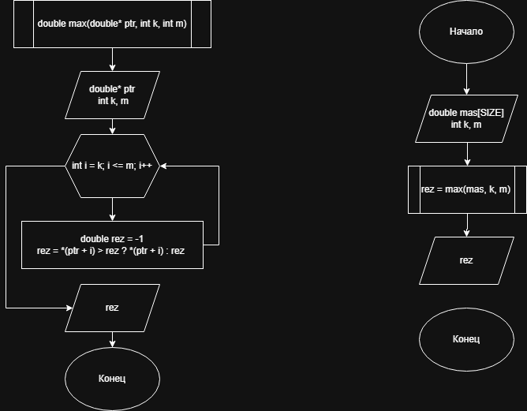

# Домашнее задание к работе 13

## Условие задачи
Реализовать функцию определения максимального значения в заданном интервале индексов (К,М)
---
## 1. Алгоритм и блок схема

### Алгоритм
1. **Начало**
2. Объявить переменные.
3. Запросить у пользователя массив и индексы.
4. В функции в цикле от К до М включительно.
5. Сравниваем ptr[i] с rez изначально равной -1 и если ptr[i] больше то rez = ptr[i].
6. Возвращаем rez.
7. Выводим rez.
8. **Конец**

### Блок-схема


 [Ссылка на блок-схему](https://viewer.diagrams.net/?tags=%7B%7D&lightbox=1&highlight=0000ff&edit=_blank&layers=1&nav=1&title=Lab14_schema.drawio&dark=auto#Uhttps%3A%2F%2Fdrive.google.com%2Fuc%3Fid%3D1ATMwmefA7Fp1y0QSY6EnV0K9pSrMPbAa%26export%3Ddownload)

 ## 2. Реализация программы

```c
#include <stdio.h>
#include <locale.h>
#define SIZE 10
double max(double* ptr, int k, int m);

int main() {

	double mas[SIZE];
	int k, m;

	setlocale(LC_ALL, "RUS");

	printf("Введите массив: ");
	for (int i = 0; i < SIZE; i++) {
		scanf("%lf", &mas[i]);
	}

	printf("Введите k и m");
	scanf("%d %d", &k, &m);

	printf("%lf", max(mas, k, m));
}
double max(double* ptr, int k, int m) {
	double rez = -1;

	for (int i = k; i <= m; i++) {
		rez = *(ptr + i) > rez ? *(ptr + i) : rez;
	}
	return rez;
}
```
# 3. Результаты работы программы
<br>Введите массив: 0
<br>1
<br>2
<br>3
<br>4
<br>5
<br>6
<br>7
<br>8
<br>9
<br>
<br>Введите k и m 2 6 
<br>
<br>6
<br>Для продолжения нажмите любую клавишу . . .
# 4. Информация о разработчике
Авраменко Дмитрий бИПТ-251
